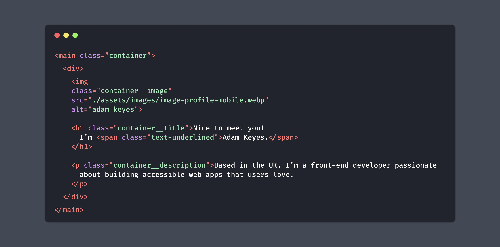
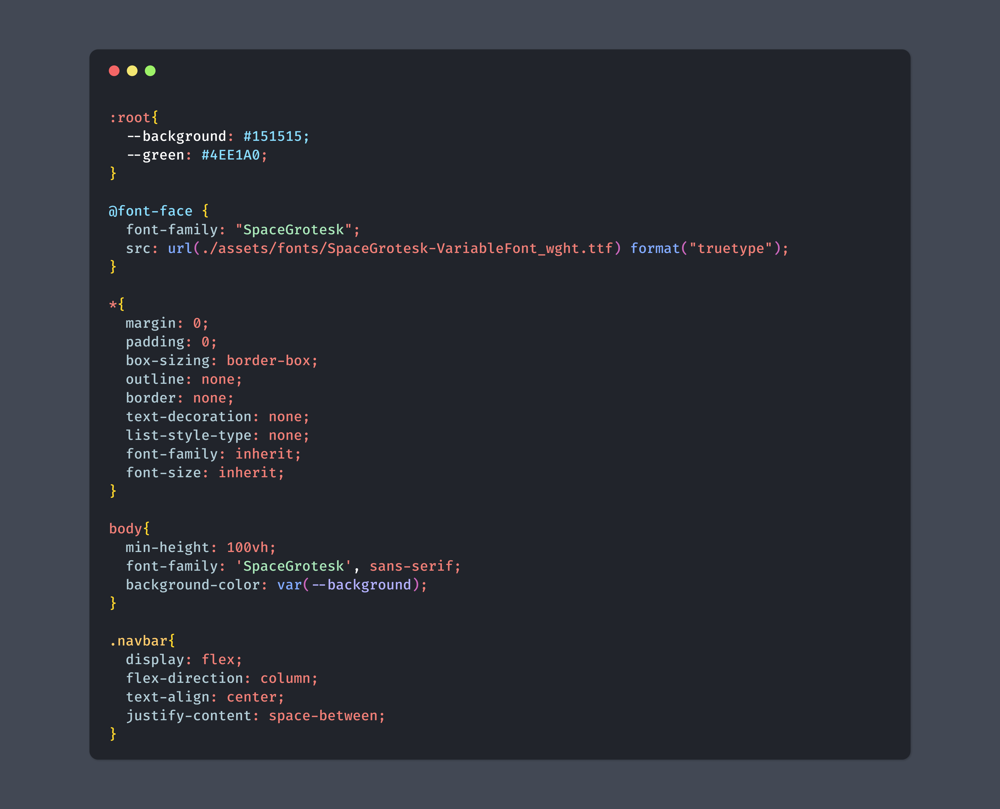

# TheCoderGuru Lightgrey

## Screenshots

 

### HTML

 

 

### CSS

 

 

 

## Theming Reference

[VS Code Theme Color Reference](https://code.visualstudio.com/docs/getstarted/theme-color-reference)

[VS Code Theme Documentation](https://code.visualstudio.com/docs/extensions/themes-snippets-colorizers)

[VS Code Publishing Extensions](https://code.visualstudio.com/docs/extensions/publish-extension)

[VS Code Color Theme](https://code.visualstudio.com/api/extension-guides/color-theme)

 

 

## Installation via VS Code

1. Open **Extensions** sidebar panel in VS Code. `View -> Extensions`
2. Search for `TheCoderGuru Dark`
3. Click **Install** to install it
4. Click **Reload** to reload the editor
5. Code -> Preferences -> Color Theme -> **TheCoderGuru Dark**

 

 

## Manual Installation

Read the [VSC Extension Quickstart Guide](https://github.com/TheCoderGuru/thecoderguru_dark/blob/main/vsc-extension-quickstart.md)

